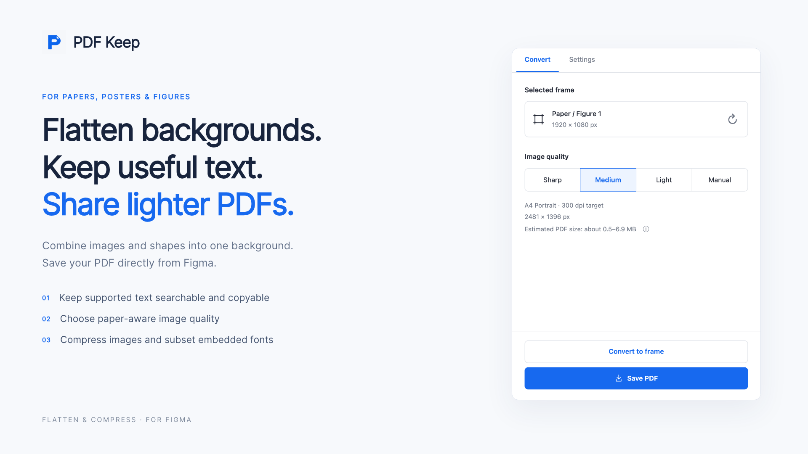

# PDF Keep

[](https://github.com/toshi-pono/pdf-keep/actions/workflows/ci.yml)
[](LICENSE)
[](https://www.figma.com/community/plugin/1681089320786833087/pdf-keep)



Figma の画像・図形を一枚の背景にまとめ、対応する文字を検索・コピー可能なまま残すプラグインです。背景の解像度調整と埋め込みフォントの軽量化で、元の背景画像や個別の背景レイヤーを持ち込まずに、共有しやすい PDF を作成します。容量の削減量はデザインと設定によって異なります。

[Figma Community で PDF Keep を使う](https://www.figma.com/community/plugin/1681089320786833087/pdf-keep)

[English](README.md)

## How it works

1. Figma で**フレームを一つ選び**、**PDF Keep** を起動します。
2. **Sharp・Medium（既定）・Light・Manual**から画質を選びます。Medium は A4 幅・300 dpi を基準に最大3倍まで拡大します。A0・A1 ポスターなどの用紙サイズは「詳細設定」で変更できます。
3. **PDF を保存**を押すと、生成後に保存を自動開始します。または **Frame に変換**で、背景画像と編集可能な文字を持つ新しいフレームを作り、Figma 標準の PDF Export を使います。

トリミングや不透明な図形による目隠しを背景画像に焼き込み、その上に対応する文字を配置します。未対応の文字はアウトラインに切り替えられます。元のフレームは変更しません。文書の文字・画像は端末内で処理し、フォントの自動取得時のみ Google Fonts の公式配信元へ接続します。その他のフォントは静的 TTF を追加できます。

アウトライン化・画像化した文字は検索・コピーできません。保持した文字は取り出せるため、文字の秘匿・墨消し用ではありません。Figma 標準 PDF の文字の扱いは Figma の出力仕様に依存します。

## Development

Node.js 22.13 以降と npm が必要です。

```sh
npm ci
npm run build
```

Figma デスクトップ版の **Plugins → Development → Import plugin from manifest…** で、このリポジトリの `manifest.json` を選び、**PDF Keep** を起動します。

コードの整形は `npm run format`、全検証は `npm run check`、配布 ZIP の作成は `npm run package` で実行します。ブラウザテストに必要なツール、構成、CI は[開発手順](docs/development.md)を参照してください。

## 言語対応

画面は日本語・英語・韓国語に対応しています。「詳細設定 → 言語」で選択すると、この端末に設定を保存します。起動時は保存した選択、ブラウザの言語、英語の順に使用します。`ko-KR` などの地域付きコードも基本言語で判定します。読み込み失敗時は環境言語を使用し、保存失敗時は現在の選択を維持したまま通知します。処理中の言語変更でも、書き出しを再開せずに既存の進捗・警告・エラーを切り替えられます。

翻訳は i18next / react-i18next で管理し、アプリに同梱します。言語を追加するときは `src/i18n/languages.ts` にコードと母語表記を登録し、`src/i18n/locales/` に型付きリソースを追加して `src/ui/i18n.ts` に登録します。文言は意味に基づく安定したキーで全言語に追加し、名前付きの `{{変数}}`、件数には `_one` / `_other` を使います。型付きの `msg(key, params)` を利用し、例外・コールバック・Worker／プラグイン通信でも構造を保ち、UI で表示するときだけ翻訳してください。外部エラーや文書の名前は原文の文字列として扱います。`npm run check` で翻訳の網羅性、変数、設定保存、言語切り替えを検証できます。

## Acknowledgement

PDF Keep は [React](https://github.com/facebook/react)、[i18next](https://github.com/i18next/i18next)、[react-i18next](https://github.com/i18next/react-i18next)、[jsPDF](https://github.com/parallax/jsPDF)、[pdf-lib](https://github.com/Hopding/pdf-lib)、[svg2pdf.js](https://github.com/yWorks/svg2pdf.js)、[opentype.js](https://github.com/opentypejs/opentype.js)、[HarfBuzz](https://github.com/harfbuzz/harfbuzz) / [harfbuzzjs](https://github.com/harfbuzz/harfbuzzjs)、[fast-png](https://github.com/image-js/fast-png)、[fast-text-encoding](https://github.com/samthor/fast-text-encoding) を利用しています。

依存ライブラリのライセンスは [licenses](licenses/)、回帰テスト用フォントのライセンスはソースリポジトリ内の各素材に同梱しています。
